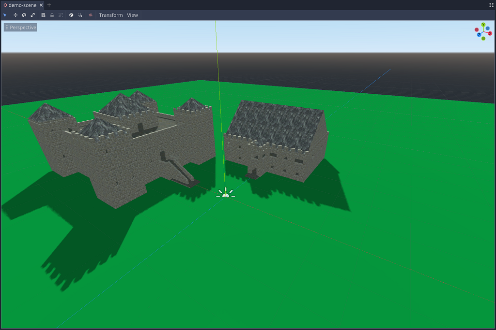
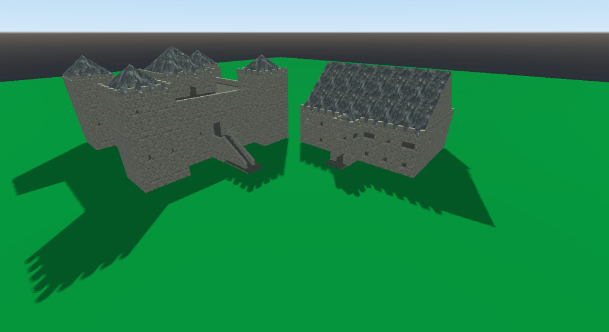

# Malcolm-Snap-Castle
Godot addon for easily constructing castle and fort assets.

# GridMap Settings
When using the Snap Castle mesh-library; the GridMap should be set to:
 * Cell-size of 1,4,1
 * No centering in X/Y/Z

# Object Control and Interaction
The following objects support control and interaction.

## Castle Door
Castle doors can be detected using physics collision, `RayCast`, or
`intersect_ray` and reside on layer 2. These forms of detection will actually
find the `CastleDoorBody` KinematicBody node which exposes a `door` variable
to access to the `CastleDoor` controller.

The `CastleDoor` controller has the following capabilities:
 - `door_opened` signal when the door opens
 - `door_closed` signal when the door closes
 - `opened` property that can open or close the door
 - `enabled` property that can enable or disable (hide) the door
 - `user_data` dictionary for any custom game data such as locked state or required keys

## Castle Chest
Castle chests can be detected using physics collision, `RayCast`, or
`intersect_ray` and reside on layer 2. These forms of detection will actually
find the `CastleChestLid` KinematicBody node which exposes a `chest` variable
to access the `CastleChest` controller.

The `CastleChest` controller has the following capabilities:
 - `chest_opened` signal when the chest is opened
 - `chest_closed` signal when the chest is closed
 - `opened` property that can open or close the door
 - `user_data` dictionary for any custom game data such as locked state or required keys

## Castle Sconce
The `CastleSconce` controller has the following capabilities:
 - `lit` property that can light or extinquish the sconce
 - `light_source` property that controls whether a lit sconce turns on an `OmniLight` source
